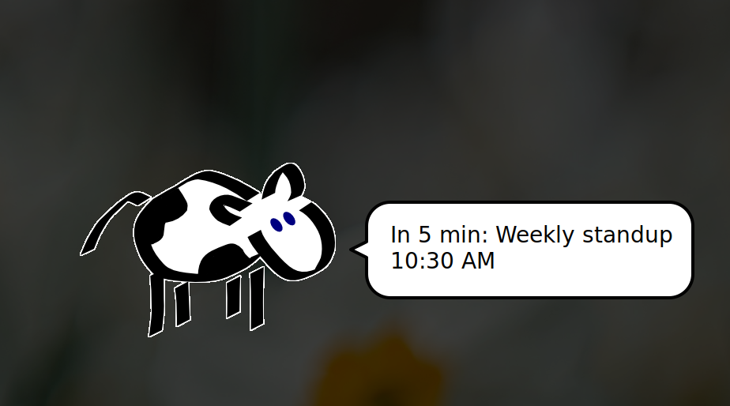
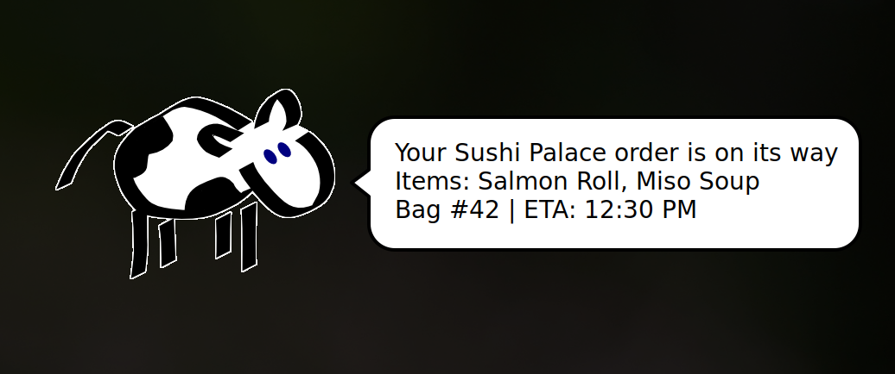

# moo-notify

A pluggable desktop notification broadcast service. Sources produce notifications, notifiers display them — all via [xcowsay](https://github.com/nickg/xcowsay).



## Install

### 1. Install xcowsay

```bash
sudo apt install xcowsay
```

### 2. Install the service

```bash
git clone <this-repo> ~/code/moo-notify
cd ~/code/moo-notify
./setup.sh
```

`setup.sh` installs Node.js deps, creates `~/.config/moo-notify/`, walks you through Google OAuth if `credentials.json` is present, installs and starts the systemd user service.

To run without systemd:

```bash
npm install
node index.js
```

### 3. Enable the plugins you want

```bash
./moo-ctl list                    # see all plugins and their status
./moo-ctl enable google-calendar  # enable a plugin
./moo-ctl disable hungerhub       # disable a plugin
./moo-ctl restart                 # restart to apply changes
```

### 4. Verify it's running

```bash
systemctl --user status moo-notify.service
```

### 5. Test that the cow can talk

```bash
./tests/test-notification.sh            # show all sample notifications
./tests/test-notification.sh calendar   # google calendar format
./tests/test-notification.sh hungerhub  # hungerhub delivery format
./tests/test-notification.sh socket     # unix socket format
```

Runs xcowsay directly with sample data — no service needed. If the cow doesn't appear, check the logs:

```bash
tail -f ~/.config/moo-notify/broadcast.log
```

## Sources

### Google Calendar

Polls your primary Google Calendar every 60s and notifies at 5 min and 1 min before events.

**Setup:**

1. Go to [Google Cloud Console](https://console.cloud.google.com/)
2. Create a project and enable **Google Calendar API**
3. Go to **APIs & Services > Credentials**
4. Create **OAuth 2.0 Client ID** (Desktop app)
5. Download the JSON and save it to `~/.config/moo-notify/credentials.json`
6. Run `./setup.sh` — it will open a browser for the OAuth flow

### HungerHub

Tracks food delivery orders and notifies on status changes (picked up, on the way, delivered).



**Setup:**

Set these environment variables before starting the service:

```bash
export HUNGERHUB_EMPLOYEE_ID=12345
export HUNGERHUB_TOKEN=your-access-token
```

The systemd service passes these through via `PassEnvironment`.

### Unix Socket

Listens on `~/.config/moo-notify/notify.sock` for ad-hoc JSON notifications. Use this to pipe notifications from scripts, cron jobs, or other tools.

**Send a notification:**

```bash
node notify-send-socket.js "Title" "Body text"
```

Or with socat:

```bash
echo '{"title":"Hello","body":"world"}' | socat - UNIX-CONNECT:$HOME/.config/moo-notify/notify.sock
```

## Custom configuration

Use `./moo-ctl` to enable/disable plugins, or place a `config.json` in `~/.config/moo-notify/` to override the full plugin list with custom options:

```json
{
  "sources": [
    { "path": "./src/plugins/sources/google-calendar", "config": { "thresholds": [10, 5, 1], "pollInterval": 30 } },
    { "path": "./src/plugins/sources/unix-socket", "config": {} }
  ],
  "notifiers": [
    { "path": "./src/plugins/notifiers/xcowsay", "config": { "time": 10, "monitor": 0 } }
  ]
}
```

## Files

| Path | Description |
|---|---|
| `~/.config/moo-notify/credentials.json` | Google OAuth client secret (you provide) |
| `~/.config/moo-notify/token.json` | Cached OAuth token (auto-generated) |
| `~/.config/moo-notify/config.json` | Optional custom plugin configuration |
| `~/.config/moo-notify/hungerhub-state.json` | Persisted order tracking state (survives restarts) |
| `~/.config/moo-notify/notify.sock` | Unix socket for ad-hoc notifications |
| `~/.config/moo-notify/broadcast.log` | Log file |

## Development

### Running tests

```bash
npm test
```

Uses `node:test` (built-in, zero dependencies). Tests live in `tests/`.

## Credits

Thanks to [Nick Gasson](https://github.com/nickg) for creating [xcowsay](https://github.com/nickg/xcowsay) — the finest cow-based notification system on the Linux desktop.
